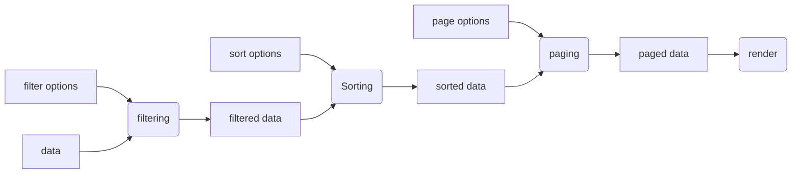

# SimplyFlow: model

This implements a viewmodel base class that allows you to easily add sorting, paging and filtering (among others,) using effects ([see State](./state.md)

```javascript
	import {model, sort, paging} from 'simplyflow/src/model.mjs'

	const data = [
		{ id: 1, value: 100 },
		{ id: 2, value: 42 },
		{ id: 3, value: 29 },
		// ...
	]

	const myModel = model({
		data
	})

	myModel.addEffect(sort({ sortBy: 'value'}))

	myModel.addEffect(paging({ pageSize: 10 }))
```

## Flow-based programming

This library uses signals and effects to implement a flow-based programming model. In a normal programming model, when you change data, you then need to call functions or methods to make sure that the changes update the program state and rendering. In a flow based model, data changes automatically trigger those updates.



This is a diagram that shows the model implemented above, with an extra filter step included. If the data changes, the model will sort the data and then page the data and finally render it. If the page changes, the model will use the already sorted data and apply paging again and then render it. It will not sort the data again, since those inputs haven't changed.

You can create as complex a model as you want, and be sure that all user inputs will be rendered correctly and only re-run the parts of your code that are affected.

## Setting the model up

There is a single function `model` to create a new model. It has a single options parameter, with these properties:

- data (required).
  The data to start the model with
- options (optional).
  Any initial options to use, with effects that you add later

The model function returns an object with these properties:

- state
  Contains the current state of the model, including the data and options you initially set.
- effects
  An array with the effects applied. effects[0] will just be `{ current: state.data }`
- view
  The data to be rendered, after all effects have been applied

## Sorting

To sort the data, you add an effect that takes some input describing the sort options and returns a function that takes the data to be sorted as an input, like this:

```javascript

function mySort(options={}) {
	this.state.options.sort = Object.assign(this.state.options.sort || {}, options)
	return function(data) {
		return effect(() => {
			if (this.state.options.sort.sort) {
				return data.current.toSorted()
			}
			return data.current
		})
	}
}
```

Then add this sort effect like this:

```javascript
myModel.addEffect(mySort({sort:true}))
```

Or you can use the provided sort function, which requires your data to be an array of objects:

```javascript
import {sort} from 'simplyflow/src/model.mjs'

myModel.addEffect(sort())
```

This sort function has the following options:

- sortBy: The property to sort by
- sortDirection: Either 'asc' (default) or 'desc'
- sortFn: (optional) The actual sort function to use.

## Filtering

Some user interfaces allow the user the filter a list of data, or search for entries that match some query. You can implement this as a filter effect, that is called before sorting and paging.

```javascript
	import {model, sort, paging, filter} from 'simplyflow/src/model.mjs'

	const myModel = model({
		data
	})

	myModel.addEffect(filter({ name: 'value', matches: (v) ==> v==42 }))

	myModel.addEffect(sort({ sortBy: 'value'}))

	myModel.addEffect(paging({ pageSize: 10 }))
```

Filter options are:

- name: The name of the property to filter
- matches: The function to filter with. It has one parameter and should return true or false. If true, the value is kept. If false, the value is filtered out.

## Paging

Paging allows you to show only a part of a larger list of data. This effect should be added after filtering and sorting. The model library includes a default paging effect you can use:

```javascript
	import {model, sort, paging} from 'simplyflow/src/model.mjs'

	const data = [
		{ id: 1, value: 100 },
		{ id: 2, value: 42 },
		{ id: 3, value: 29 },
		// ...
	]

	const myModel = model({
		data
	})

	myModel.addEffect(sort({ sortBy: 'value'}))

	myModel.addEffect(paging({ pageSize: 10 }))
```

The paging options are:

- pageSize: The number of items to show on a single page
- page: Which page to show, starts at 1
- max: The total number of page, this is automatically calculated

The reason `max` is added as an option is to make it easy to show the current and total number of pages in the dataset in your user interface, e.g:

```html
<nav>
	<button>Previous</button>
	<span data-flow-field="myModel.options.paging.page"></span>
	/
	<span data-flow-field="myModel.options.paging.max"></span>
	<button>Next</button>
</nav>
```

## Columns

Finally the model library provides an effect that allows you to select which properties to show or remove from the objects in your data. This can be useful when showing a datagrid, where you can select which columns to show or hide.

```javascript
	import {model, sort, paging, filter, columns} from 'simplyflow/src/model.mjs'

	const myModel = model({
		data
	})

	myModel.addEffect(sort({ sortBy: 'value'}))

	myModel.addEffect(paging({ pageSize: 10 }))

	myModel.addEffect(columns({
		columns: {
			id: {
				hidden: true
			}
		}
	}))
```

Options are:

- columns: An object with the properties you want to show or hide. Each property must be an object with an optional sub property `hidden`. If set to true, the column (property) will be filtered out.

## Rendering

You can render the final data using the SimplyFlow bind library, like this:

```html
<!doctype html>
<table data-flow-list="myModel.view">
	<template>
		<tr data-flow-map=":value">
			<template>
				<td data-flow-field=":value"></td>
			</template>
		</tr>
	</template>
</table>
<script>
	// implement setup and myModel instantiation here

	bind({
		attribute: 'data-flow',
		root: {
			myModel
		}
	})
</script>
```

Or you can create your own render effect and add it as the final step, like this:

```javascript
	import {model, sort, paging, filter, columns} from 'simplyflow/src/model.mjs'

	const myModel = model({
		data
	})

	myModel.addEffect(sort({ sortBy: 'value'}))

	myModel.addEffect(paging({ pageSize: 10 }))

	myModel.addEffect(columns({
		columns: {
			id: {
				hidden: true
			}
		}
	}))

	myModel.addEffect((data) => {
		// render the data with your own code.
	})
```
